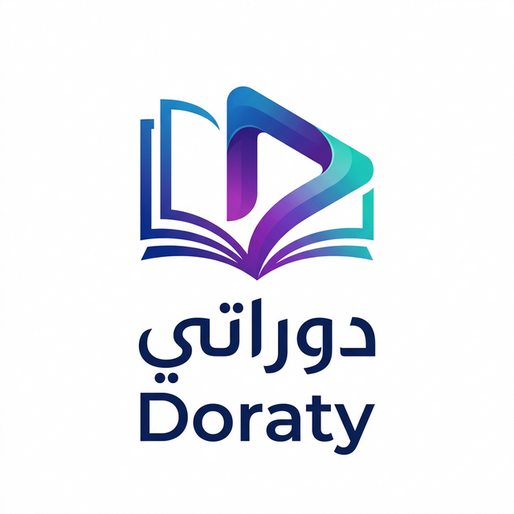

#  Doraty – Smart Educational Platform | دوراتي – المنصة التعليمية الذكية

[English](#english) | [العربية](#arabic)

---

# 🎓 دوراتي – المنصة التعليمية الذكية 🇸🇦

دوراتي هي منصة تعليمية متطورة تهدف إلى تمكين الطلاب والمعلمين من خلال أنظمة اختبارات مؤتمتة، بنوك أسئلة ذكية، وإدارة منظمة للكورسات. صُممت لتكون سريعة، آمنة، وسهلة الوصول من جميع الأجهزة.

## 🚀 المعاينة المباشرة
- **صفحة الهبوط:** [doraty.app](https://doraty.app)
- **تطبيق الويب:** [doraty-app.vercel.app](https://doraty-app.vercel.app)

---

## ✨ المميزات الرئيسية

- **🛡️ نظام اختبارات مؤتمت**
  - إنشاء، جدولة، وتصحيح تلقائي للاختبارات.
  - قيود زمنية، أسئلة عشوائية، ونتائج فورية.
- **📚 بنوك أسئلة ذكية**
  - بناء مكتبات أسئلة حسب المادة والموضوع والصعوبة.
- **📁 إدارة الكورسات**
  - مسارات تعليمية منظمة وترتيب للمحتوى.
- **🌐 دعم منصات متعددة**
  - تجربة أداء عالية على الويب، أندرويد، وويندوز.
- **🔐 تسجيل دخول آمن**
  - دخول سلس وآمن عبر حساب جوجل (Google OAuth 2.0).
- **🌍 دعم لغتين**
  - واجهة كاملة باللغتين العربية (RTL) والإنجليزية (LTR).
- **☁️ مزامنة سحابية**
  - مزامنة البيانات في الوقت الفعلي عبر جميع الأجهزة باستخدام Supabase.

---

## 🛠️ التقنيات المستخدمة

### صفحة الهبوط (Landing Page)
- **الإطار:** [Next.js 14](https://nextjs.org/) (App Router)
- **اللغة:** [TypeScript](https://www.typescriptlang.org/)
- **التنسيق:** [Tailwind CSS](https://tailwindcss.com/)
- **الأيقونات:** [Lucide React](https://lucide.dev/)
- **الاستضافة:** [Vercel](https://vercel.com/)

---

## 📱 تحميل التطبيق

- **الويب:** [فتح تطبيق الويب](https://doraty-app.vercel.app)
- **أندرويد:** [تحميل APK](https://github.com/Omarrawas/doraty-app/releases/latest/download/app-release.apk) (يدعم ARM64, ARMv7a, x86_64)
- **ويندوز:** [تحميل لويندوز](https://github.com/Omarrawas/doraty-app/releases/latest/download/Doraty-Windows.zip)

---

 
 

# 🎓 Doraty – Smart Educational Platform 🇬🇧

Doraty is a cutting-edge educational platform designed to empower students and teachers through automated exams, smart question banks, and organized course management. Built for speed, security, and accessibility across all devices.

## ✨ Key Features

- **🛡️ Automated Exam System**
  - Create, schedule, and auto-grade exams.
  - Time limits, randomized questions, and instant results.
- **📚 Smart Question Banks**
  - Build libraries by subject, topic, and difficulty.
- **📁 Course Management**
  - Structured learning paths and content organization.
- **🌐 Multi-Platform Support**
  - High-performance experience on Web, Android, and Windows.
- **🔐 Secure Authentication**
  - Seamless login via Google OAuth 2.0.
- **🌍 Bilingual Support**
  - Fully localized in Arabic (RTL) and English (LTR).
- **☁️ Cloud Sync**
  - Real-time data synchronization across all devices via Supabase.

---

## 🛠️ Technology Stack

### Landing Page
- **Framework:** [Next.js 14](https://nextjs.org/) (App Router)
- **Language:** [TypeScript](https://www.typescriptlang.org/)
- **Styling:** [Tailwind CSS](https://tailwindcss.com/)
- **Icons:** [Lucide React](https://lucide.dev/)
- **Deployment:** [Vercel](https://vercel.com/)

---

## � License | الترخيص
© 2026 Doraty. All rights reserved. | جميع الحقوق محفوظة لدوراتي.

---

## 🤝 Contact | التواصل
For support or inquiries: [support@doraty.app](mailto:support@doraty.app) | للدعم الفني والاستفسارات.
